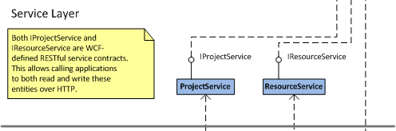

PURPOSE
-------
The purpose of CiteSet is to capture project-related information. My goal was to simplify the wonderful ideas of projects like [Chandler](http://chandlerproject.org), [Delicious](http://delicious.com), and [RedNotebook](http://rednotebook.sourceforge.net). For example, I wanted a place to store information about software projects that I had started. I might have source files, journal entries, Internet resources and links. All of this information needed to be culled into a single spot where I could easily manage my musings. 

At the same time, CiteSet represents what I think is the simplest possible solution that can work for an archetypal kind of modern application: the application must be composed of independent parts, and it must have various well-known layers (data for persistence, service for supporting various user interface designs, and application for managing service lifecycle). 

GENERAL CHARACTERISTICS
-----------------------
Generally speaking, CiteSet is config-driven so things like database connection strings and RESTful service endpoints are defined in the configuration files. Additionally, each component uses the [Microsoft Enterpise Libary](http://msdn.microsoft.com/en-us/library/ff648951.aspx) to inject new instances at runtime which means that logging can be selectively enabled in the configuration files. Finally, the service endpoints are supported by a configuration extention that defines a Factory class. This means that new Factory implementations can be added later, as needed.

DATA LAYER
----------
In my case, I don't need robust persistence and I prefer working with plain-old objects when the data has little chance of being aggregated, so I chose to use [Db4o](http://www.db4o.com/) (ask me about my [MembershipProvider](http://msdn.microsoft.com/en-us/library/system.web.security.membershipprovider.aspx) implementation for Db4o sometime!). The Db4o logic is straightforward, the API is clean, and the file structure doesn't have the complexity of other object stores like [RavenDB](http://ravendb.net).

SERVICE LAYER
-------------
The service layer is RESTful for the sake of simplicity. Similar to the choice of Db4o, RESTful services are expected to subscribe to well-known paradigms which make them easy for developers to leverage. In this case, I chose to expose two endpoints: 1) projects and 2) resources. Projects represent the highest level container for project-related data and information. Resources represent files and links that are associated with a project either directly or tangentally. These two entities seemed like the most obvious to be manipulated, and I had plans to build in some batch import features, so for now these are the two exposed endpoints. The addressability relies on GUIDs which is ugly, but gets the job done.

The most novel element of the service layer, and the beginning of the batch processing that I want, is the PageAdapter and ResourceBridge which will work together to read the link and meta tags from a web page and add them to the data store. This basically saves me from adding tags everytime I add a web reference to a project. True, I might end up with some SEO garbage, but I think it's better to remove the metadata I don't need than to slow down the process of adding.

APPLICATION LAYER
-----------------
Finally, the application layer manages the lifecycle of the database and service endpoints. Ideally, the RESTful service would be accessed by multiple clients, so a Windows service made the most sense as host. Besides, I didn't want users to have to install a web server; so CiteSet is as self-contained and minimalistic as it can possibly be.

INSTALLATION
------------
To install the application, unzip the release package to the directory of your choice. The release package contains:

* A console application for temporary deployments or developing,
* A Windows service application for long-running deployments,
* Batch files for installing and uninstalling the Windows service.

Each application has its own configuration file. The &lt;connectionStrings&gt; section contains a single connection string for the database service. The format conforms to the [Uri class](http://msdn.microsoft.com/en-us/library/system.uri.aspx), but it is essentially a file path; the value of the AbsolutePath represents a directory rooted at ``C:\``. The default location is in the root, but could be changed to something like ``/Users/<someuser_name>/AppData/Local``, if desired.

Both the database and service endpoints have port numbers that might be blocked by the local firewall, so it might be necessary to allow these ports to transmit data.

Copyright (c) 2012 by Keith R. Bielaczyc. All Right Reserved.

Unless required by applicable law or agreed to in writing, software distributed under the License is distributed on an "AS IS" BASIS, WITHOUT WARRANTIES OR CONDITIONS OF ANY KIND, either express or implied.  See the License for the specific language governing permissions and limitations under the License.

Last modified: 2012-09-16